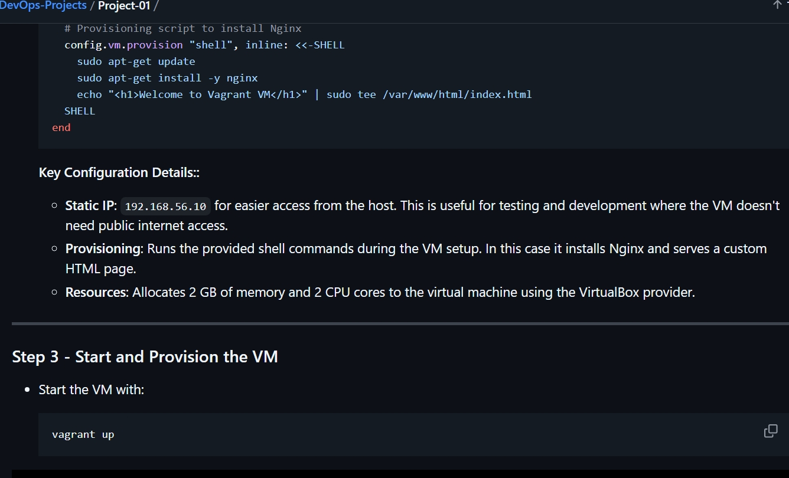
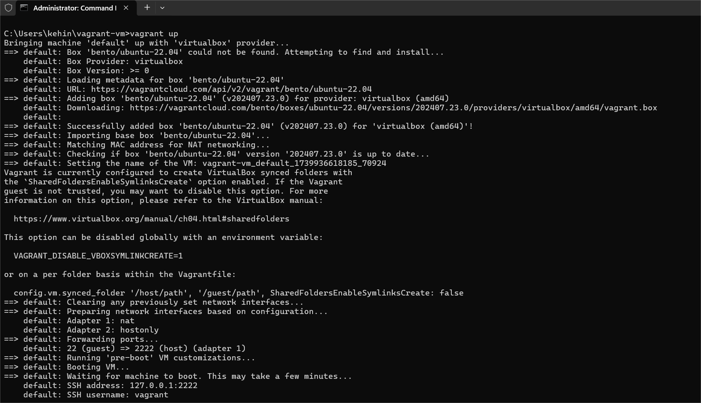
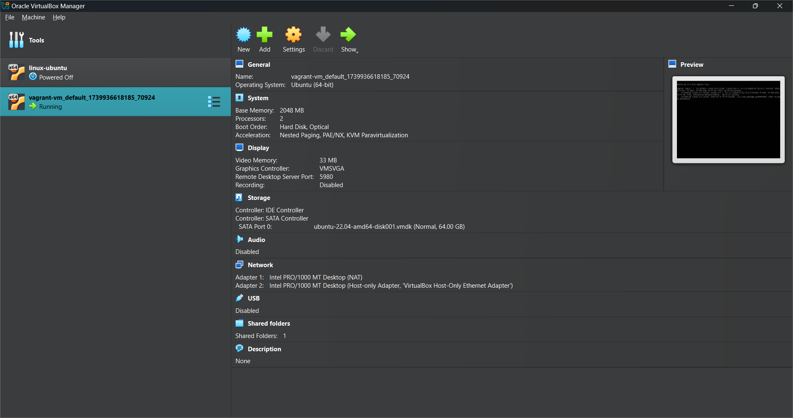
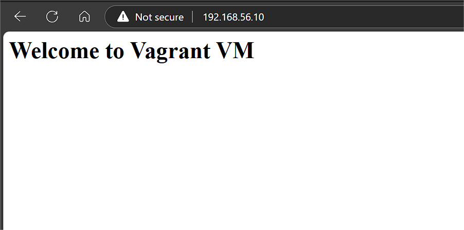

# Setting Up a Virtual Machine with Vagrant and VirtualBox: A Beginner's Guide

### Project Overview:
This project introduces you to setting up a virtual machine (VM) using Vagrant and VirtualBox. By the end, you'll have a fully configured VM running Ubuntu 22.04, serving a basic web page via Nginx. This setup is perfect for development, testing, or learning environments.

## What is Vagrant?

Vagrant is an open-source tool that simplifies the management of virtual environments. With Vagrant, you can:

  <li>Define and provision VMs using a single configuration file (Vagrantfile).</li>
  <li>Automate software installation and environment setup.</li>
 <li>Create reproducible, portable environments for teams or personal use.</li>


 ## What is VirtualBox?

VirtualBox is a hypervisor—a software that allows you to run virtual machines on your physical computer. It is developed by Oracle and supports running multiple operating systems (called "guest OS") on a single host machine.

How Vagrant and VirtualBox Work Together
Vagrant Uses VirtualBox as a Provider:
Vagrant itself does not create or manage VMs directly. Instead, it relies on providers like VirtualBox, VMware, or cloud platforms to perform the virtualization.

When you run vagrant up, Vagrant communicates with VirtualBox to create and configure the VM as specified in the Vagrantfile.

Vagrant Simplifies VirtualBox Usage:
Without Vagrant, you would have to manually configure VMs through the VirtualBox GUI or command line, which can be tedious and error-prone.

Vagrant automates this by abstracting away VirtualBox's complexity. For example, setting up networking, provisioning software, or defining VM specifications is done in a simple Vagrantfile.

Prerequisites:
Before starting, ensure you have:

VirtualBox Installed:

Install VirtualBox 

[here](https://www.virtualbox.org/)


Vagrant Installed:

Install Vagrant [here](https://developer.hashicorp.com/vagrant/install)

Command-Line Tools:
Access to a terminal or command prompt for running Vagrant commands.


Step-by-Step Implementation:

Step 1 - Initialize a Vagrant Project

Create a project directory and navigate into it:
```
mkdir vagrant-vm

cd vagrant-vm
```
Initialize the Vagrantfile with the Ubuntu 22.04 box: vagrant init bento/ubuntu-22.04

bento/ubuntu-22.04 specifies the base image (box) to be used.

The vagrant init command generates a default Vagrantfile in your project directory.

see example below


## Step 2 - Customize the Vagrantfile
Open the Vagrantfile in your text editor and make the following changes:


 ```
 Vagrant.configure("2") do |config|
  # Specify the box
  config.vm.box = "bento/ubuntu-22.04"

  # Assign a static IP address
  config.vm.network "private_network", ip: "192.168.56.10"

  # Allocate resources
  config.vm.provider "virtualbox" do |vb|
    vb.memory = "2048"
    vb.cpus = 2
end

  # Provisioning script to install Nginx
  config.vm.provision "shell", inline: <<-SHELL
    sudo apt-get update
    sudo apt-get install -y nginx
    echo "<h1>Welcome to Vagrant VM</h1>" | sudo tee /var/www/html/index.html
  SHELL
end


```








This command downloads the box (if it’s not already downloaded), creates the VM, and provisions it as defined in the Vagrantfile.

Verify from the VirtualBox that the Virtual machine is already running:




 <li>Access the VM:</li>
 
 ```
vagrant ssh

```


 ## Step 4 - Test the Web Server
Open a browser on your host machine and navigate to:
```
http://192.168.56.10 

```

You  will see the message:

"Welcome to Vagrant VM".




 ## Step 5 - Manage the VM
To stop the VM without deleting it, run:
```
vagrant halt
```
To remove the VM completely (optional), run:
```
vagrant destroy
```

This will delete all files related to the VM.

## Troubleshooting
Vagrant/VirtualBox Compatibility Issues: Ensure that your versions of Vagrant and VirtualBox are compatible. Update both to the latest versions if necessary.

Permission Issues on Linux: Use sudo to run commands like vagrant up if you encounter permission errors.

Networking Issues: Check if the private IP 192.168.56.10 is available. Use a different IP if it conflicts with your network.

 ## Conclusion
In this project, you:
 <li>Learned the basics of Vagrant and VirtualBox.</li>
<li>Configured a Vagrantfile to automate the creation of a VM.</li>

<li>
Provisioned the VM to serve a basic web page using Nginx.</li>

<li>
Managed the VM lifecycle using Vagrant commands.</li>


This setup forms a strong foundation for exploring more complex environments, including multi-VM setups, shared folders, and advanced provisioning tools.

Project Completed!🎉


